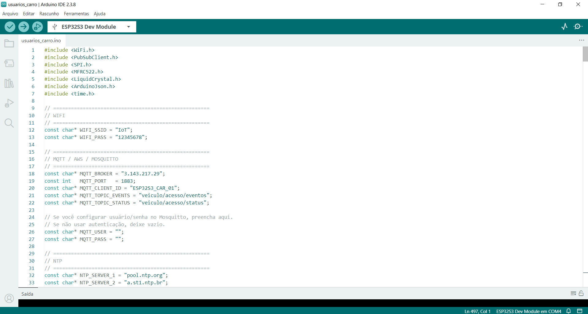
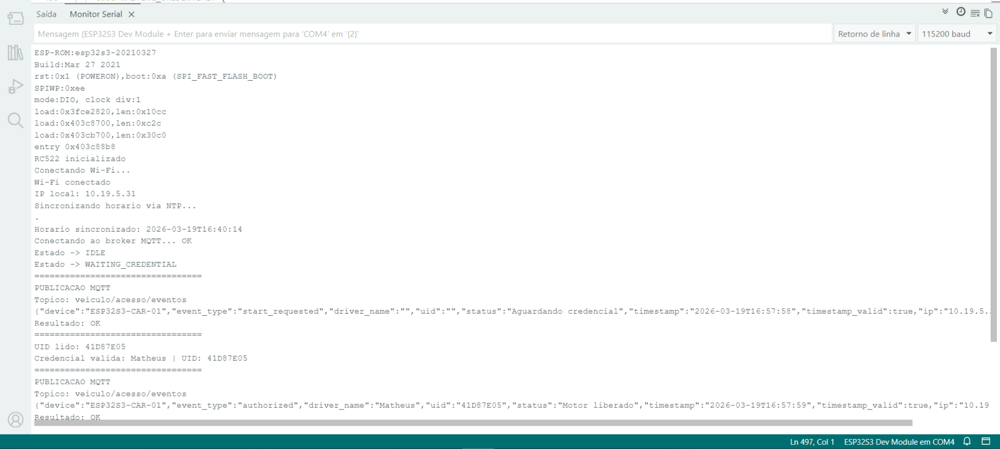
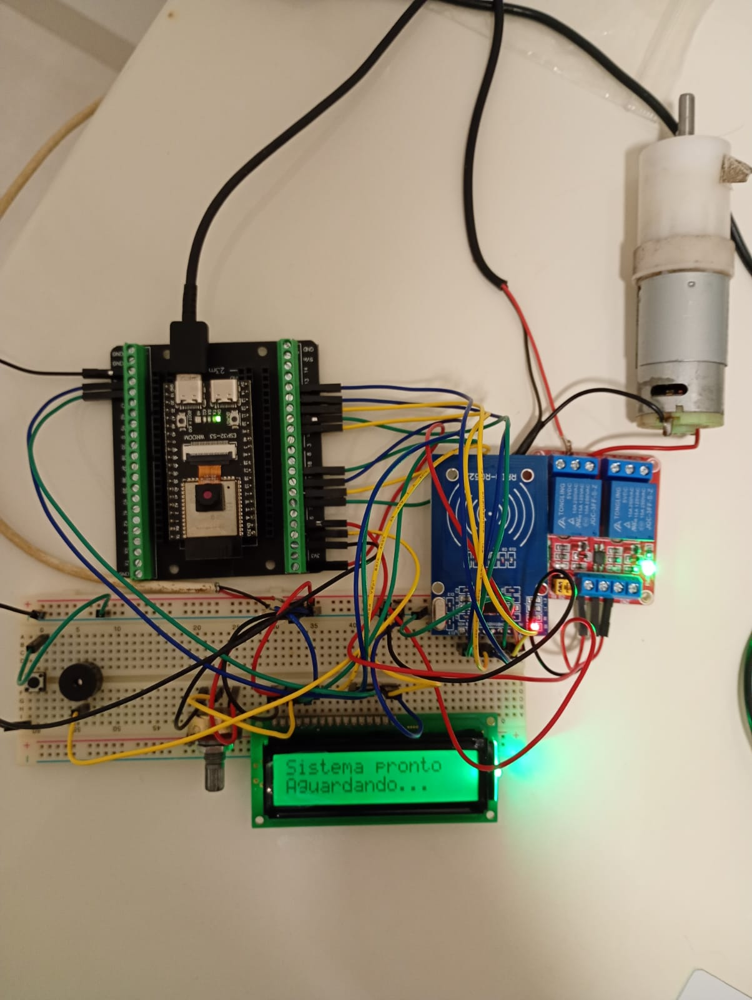
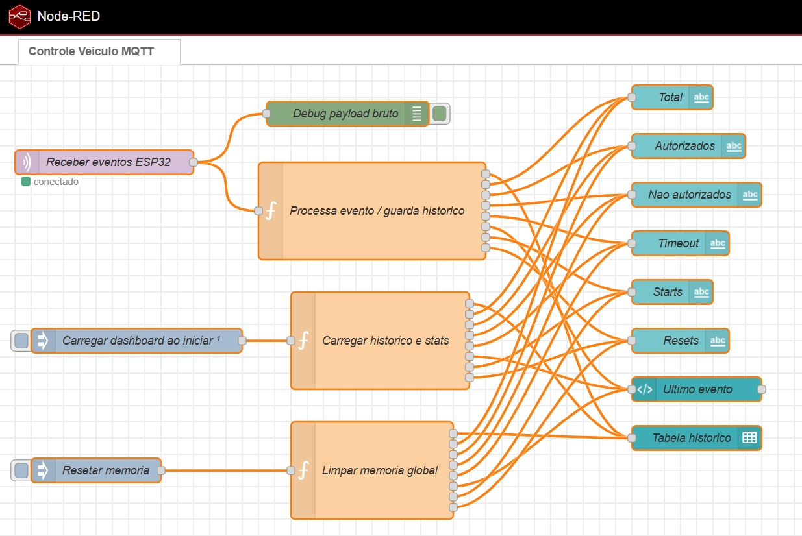
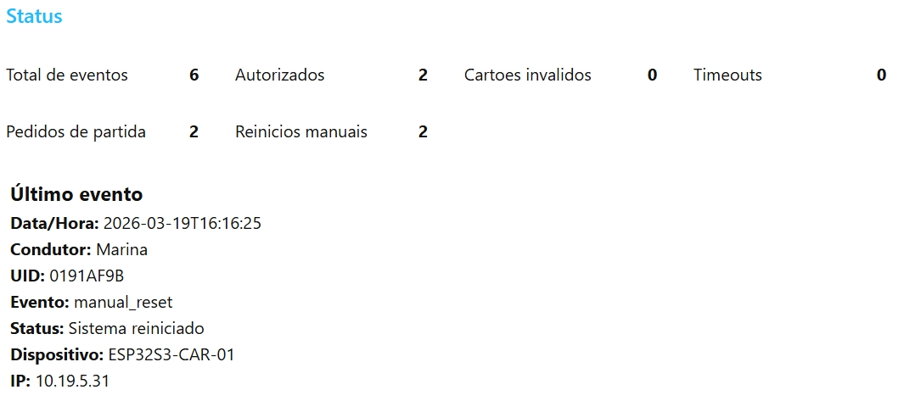
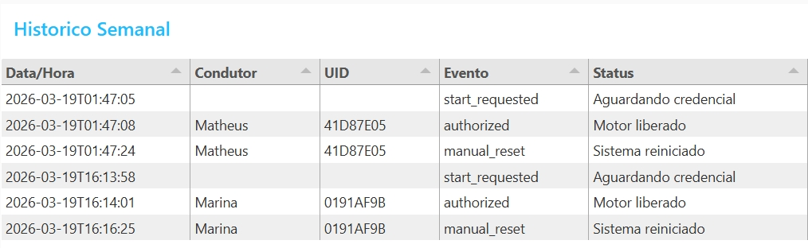

# Sistema de Controle de Uso de Veículo com RFID

## Instituto Federal de São Paulo, Campus Catanduva – IFSP  
**Curso:** CTD.LAT.ICS.2020 - ESPECIALIZAÇÃO EM INTERNET DAS COISAS  
**Aluno:** Matheus Edilson dos Santos  
**Matrícula:** CT3062031  

---

## 1. Resumo do projeto

Este projeto apresenta um sistema de controle de uso de veículo com autenticação por RFID, desenvolvido com **ESP32-S3**, **leitor RFID RC522**, **display LCD 16x2**, **buzzer**, **relé** e **motor DC 12 V** para simulação de acionamento.

O sistema exige a apresentação de uma credencial RFID válida para liberar o acionamento do motor. Todos os eventos são enviados para um servidor na **AWS** por meio do protocolo **MQTT**, utilizando o broker **Mosquitto**, e são processados no **Node-RED**, que disponibiliza um **dashboard web** para monitoramento.

---

## 2. Objetivo

Desenvolver um sistema embarcado e conectado capaz de:

- autenticar o condutor por RFID;
- impedir o uso não autorizado do veículo;
- registrar eventos de uso em servidor remoto;
- exibir o histórico e o estado atual por meio de dashboard web.

---

## 3. Tecnologias utilizadas

### Hardware
- ESP32-S3
- Leitor RFID RC522
- Display LCD 16x2
- Buzzer
- Botão de partida
- Módulo relé
- Motor DC 12 V (simulação)

### Software e serviços
- Arduino IDE 2.3.8
- AWS EC2
- Mosquitto MQTT Broker
- Node-RED
- Dashboard do Node-RED
- NTP para sincronização de horário

---

## 4. Arquitetura do sistema

```text
ESP32-S3 + RFID + LCD + Relé + Buzzer
                │
                ▼
         Broker MQTT (Mosquitto)
         AWS EC2: 3.143.217.29:1883
                │
                ▼
              Node-RED
         AWS EC2: 3.143.217.29:1880
                │
                ▼
        Dashboard Web (/ui)
```

---

## 5. Funcionamento

1. O usuário pressiona o botão de partida.
2. O sistema entra em modo de autenticação.
3. O buzzer permanece ativo até a validação.
4. O display LCD solicita a credencial.
5. Quando uma tag RFID válida é apresentada:
   - o buzzer é desligado;
   - o relé é acionado;
   - o motor é liberado;
   - um evento MQTT é publicado;
   - o Node-RED atualiza o histórico e o dashboard.
6. Quando o sistema é reiniciado manualmente, um novo evento é registrado.

---

## 6. Endereços de acesso

- **Servidor AWS (EC2):** 3.143.217.29
- **Broker MQTT (Mosquitto):** 3.143.217.29:1883
- **Node-RED:** http://3.143.217.29:1880
- **Dashboard:** http://3.143.217.29:1880/ui

**Autenticação:** sem senha nesta versão de demonstração.

---

## 7. Tópicos MQTT

- **Tópico principal de eventos:** `veiculo/acesso/eventos`
- **Tópico de status:** `veiculo/acesso/status`

### Exemplo de payload JSON

```json
{
  "device": "ESP32S3-CAR-01",
  "event_type": "authorized",
  "driver_name": "Matheus",
  "uid": "41D87E05",
  "status": "Motor liberado",
  "timestamp": "2026-03-19T16:57:59",
  "timestamp_valid": true,
  "ip": "10.19.5.31"
}
```

### Tipos de evento utilizados
- `start_requested`
- `authorized`
- `unauthorized_card`
- `timeout`
- `manual_reset`

---

## 8. Estrutura sugerida do repositório

```text
controle-veiculo-rfid-ifsp/
├── README.md
├── esp32/
│   └── LEIA-ME.txt
├── node-red/
│   └── LEIA-ME.txt
└── docs/
    └── figuras/
        ├── codigo_aberto.png
        ├── monitor_serial.png
        ├── montagem.jpeg
        ├── nodered_fluxo.jpeg
        ├── dashboard_status.jpeg
        └── historico_tabela.jpeg
```

> Observação: como o código-fonte final e o JSON exportado do fluxo não foram anexados como arquivos nesta conversa, este pacote inclui a documentação pronta e a estrutura para inclusão dos arquivos finais do projeto.

---

## 9. Evidências do funcionamento

### 9.1 Código aberto na Arduino IDE


### 9.2 Monitor serial com publicação MQTT


### 9.3 Montagem física do protótipo


### 9.4 Fluxo do Node-RED


### 9.5 Dashboard de status


### 9.6 Histórico recebido no dashboard


---

## 10. Conclusão

O projeto demonstrou a integração entre hardware embarcado, comunicação MQTT e supervisão em nuvem, permitindo o controle de acesso ao veículo com autenticação RFID e monitoramento remoto em tempo real.

A solução atende ao objetivo acadêmico proposto e pode ser expandida futuramente com:
- autenticação de acesso ao Node-RED;
- autenticação do broker MQTT;
- persistência em banco de dados;
- cadastro dinâmico de usuários;
- interface web customizada.

---

## 11. Autor

**Matheus Edilson dos Santos**  
**Matrícula:** CT3062031  
**Curso:** CTD.LAT.ICS.2020 - ESPECIALIZAÇÃO EM INTERNET DAS COISAS  
**Instituição:** Instituto Federal de São Paulo, Campus Catanduva – IFSP
